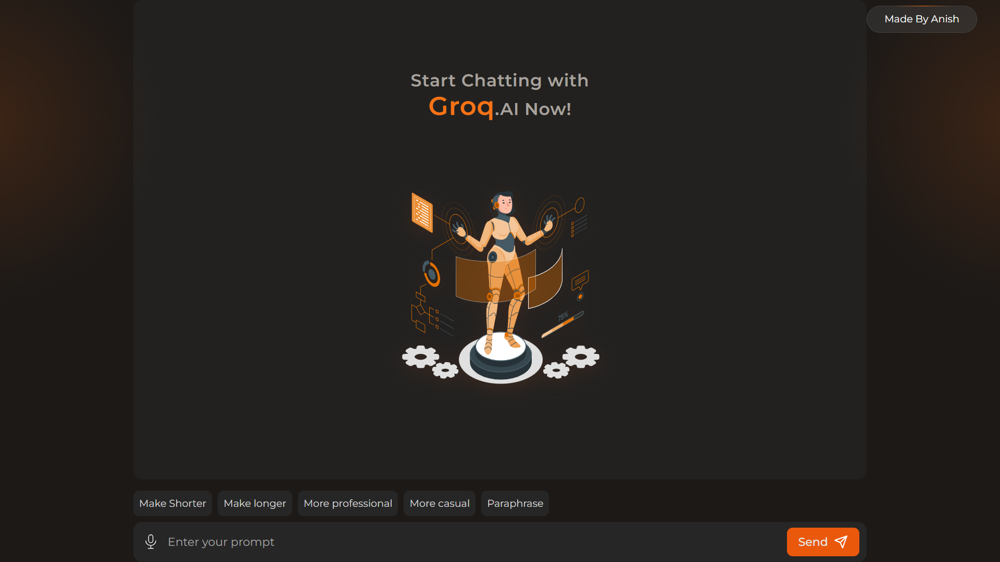

# 🚀 Next.js + Groq AI Chat Application

A lightning-fast ⚡ chat interface powered by Groq's API and built with Next.js



## ✨ Features

- 🧠 Access to powerful LLMs through Groq's API
- 🔄 Real-time chat with multiple model options
- ⏱️ Response time tracking for performance insights
- 📱 Fully responsive design for all devices
- 🌙 Dark mode support for comfortable viewing
- 🤔 "Thinking" states to see model reasoning
- 📋 Easy text copying functionality
- 🔌 Simple integration with Next.js applications

## 🤖 Available Models

- 🤖 OpenAI GPT OSS - 120B: Large-scale language understanding
- 🤖 OpenAI GPT OSS - 20B: Large-scale language understanding
- 🧪 Compound Beta: Experimental model for novel tasks
- 🌙 Moonshot Kimi K2: Advanced conversational AI
- 🐦 Qwen Qwen3 - 32B: Multilingual capabilities
- ⚡ Llama 4 Maverick - 17B 128e: Optimized for long context processing
- 🦙 Llama 4 Scout - 17B 16e: Specialized for code generation
- 🔍 Deepseek R1 Llama - 70B: Specialized for complex reasoning
- 🦙 Llama 3.3 - 70B Versatile: Balanced performance for most tasks
- ⚡ Llama 3.1 - 8B Instant: Fast responses with moderate context
- 💎 Gemma 2 - 9B IT: Lightweight model for efficient inference

## 🛠️ Getting Started

### Prerequisites

- Node.js 18.x or higher
- A Groq API key

### Installation

1. Clone the repository:

```bash
git clone https://github.com/xeven777/next-groq.git
cd next-groq
```

2. Install dependencies:

```bash
npm install
# or
yarn
# or
pnpm install
```

3. Create a `.env.local` file in the root directory:

```
GROQ_API_KEY=your_groq_api_key
```

4. Start the development server:

```bash
npm run dev
# or
yarn dev
# or
pnpm dev
```

5. Open [http://localhost:3000](http://localhost:3000) in your browser.

## 📝 Usage

1. 🔤 Type your message in the input field
2. 🔄 Select your preferred model from the dropdown
3. 🚀 Hit "Send" or press Enter
4. ⏱️ Watch as the AI responds with timing information

## 🧩 Project Structure

```
next-groq/
├── assets/           # Static assets like icons
├── components/       # React components
│   └── Chatbox.tsx   # Main chat interface
├── pages/            # Next.js pages
├── public/           # Public assets
├── styles/           # CSS styles
└── app/              # Next.js App Router
    └── api/          # API routes for Groq integration
```

## 🔧 Customization

You can customize the application by:

- Adding new models to the `models` array in `Chatbox.tsx`
- Modifying the UI theme in your Tailwind configuration
- Adding new prompt suggestions for quick user interactions

## 👨‍💻 Contributing

Contributions are welcome! Please feel free to submit a Pull Request.

1. Fork the project
2. Create your feature branch (`git checkout -b feature/amazing-feature`)
3. Commit your changes (`git commit -m 'Add some amazing feature'`)
4. Push to the branch (`git push origin feature/amazing-feature`)
5. Open a Pull Request

## 🙏 Acknowledgements

- [Groq](https://groq.com/) for their powerful API
- [Next.js](https://nextjs.org/) for the React framework
- [Vercel AI SDK](https://sdk.vercel.ai/docs) for streaming capabilities
